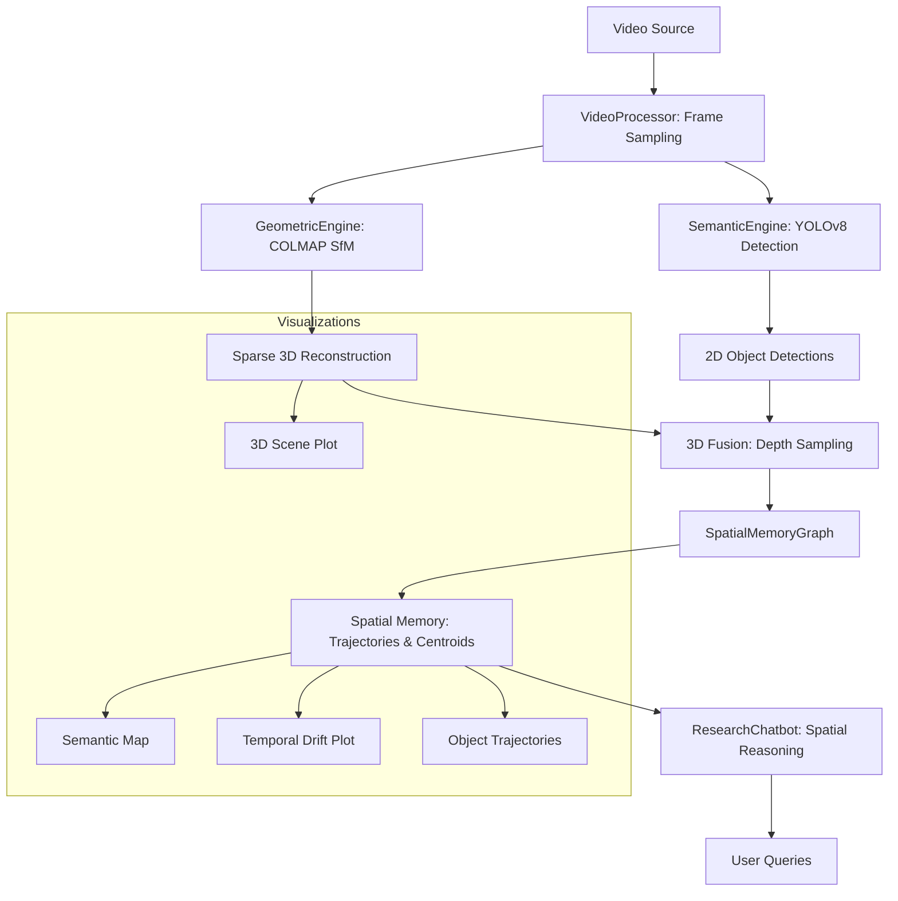

```mermaid
graph TD
    A[Video Source] --> B[VideoProcessor: Frame Sampling]
    B --> C[GeometricEngine: COLMAP SfM]
    C --> D[Sparse 3D Reconstruction]
    B --> E[SemanticEngine: YOLOv8 Detection]
    E --> F[2D Object Detections]
    D --> G[3D Fusion: Depth Sampling]
    F --> G
    G --> H[SpatialMemoryGraph]
    H --> I[Spatial Memory: Trajectories & Centroids]
    I --> J[ResearchChatbot: Spatial Reasoning]
    J --> K[User Queries]
    
    subgraph "Visualizations"
        D --> V1[3D Scene Plot]
        I --> V2[Semantic Map]
        I --> V3[Temporal Drift Plot]
        I --> V4[Object Trajectories]
    end
```
